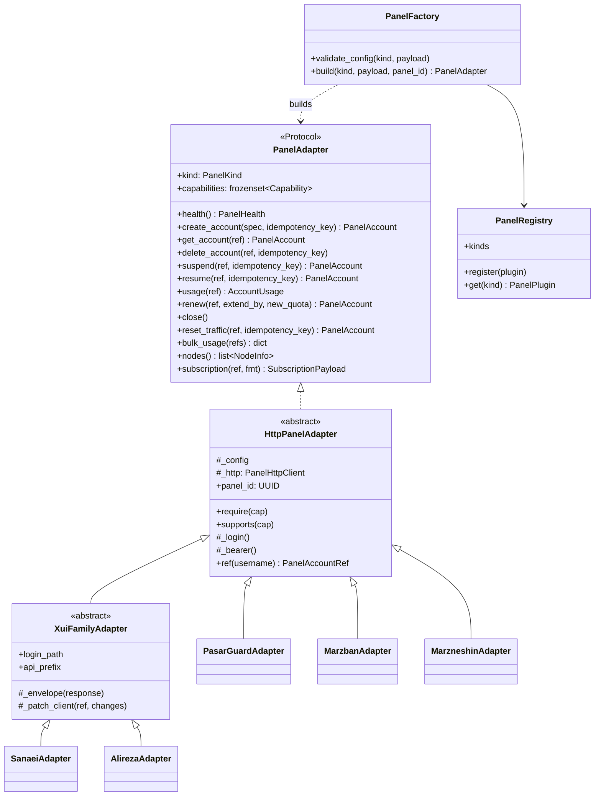
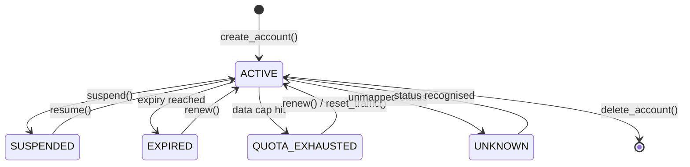

# VPN Panel Abstraction Layer

Geek VPN sells subscriptions that are fulfilled by third-party VPN panels. Those
panels disagree about almost everything: authentication, units, date formats,
status vocabulary, even whether an "account" is a first-class object or a JSON
blob nested inside an inbound.

This layer exists so that **none of that reaches the business logic**. Billing,
the bot, the Mini App and the admin panel speak one vocabulary. Each panel's
eccentricities are quarantined inside its own adapter.

## Layout

```
src/geekvpn/
  domain/panels/
    enums.py      PanelKind, Capability, AccountState, Protocol
    errors.py     PanelError taxonomy (carries `retryable`)
    values.py     AccountSpec, PanelAccount, TrafficQuota, NodeInfo, ...
  application/ports/
    panel.py      PanelAdapter - the Base Panel Interface
  infrastructure/panels/
    registry.py   plugin registry + @register_panel decorator
    config.py     per-panel pydantic settings
    http.py       shared retry/backoff/error-translation client
    base.py       HttpPanelAdapter - token caching, capability gating
    factory.py    builds an adapter from a kind + config (no panel names)
    adapters/
      pasarguard.py  marzban.py  marzneshin.py
      _xui_base.py   sanaei.py   alireza.py
```

The dependency arrow points **inwards only**: adapters know about the domain,
the domain knows nothing about adapters.

## Class model



PlantUML sources with full detail live in `docs/uml/`.

## Account lifecycle

Every panel's private status vocabulary is normalised onto five states.



`AccountState.is_usable` is `True` **only** for `ACTIVE`. `UNKNOWN` is
deliberately not usable: if a panel upgrade introduces a status we have never
seen, the safe failure mode is to withhold access and alert, not to silently
keep serving traffic.

## Capability matrix

Capabilities describe what a panel can do **natively**. They are not feature
flags and they are not aspirational - each one is verified in the test suite.

| Capability | PasarGuard | Marzban | Marzneshin | Sanaei (3x-ui) | Alireza (x-ui) |
|---|:---:|:---:|:---:|:---:|:---:|
| `RESET_TRAFFIC` | Y | Y | Y | Y | Y |
| `NATIVE_EXPIRY_EXTEND` | Y | Y | Y | Y | Y |
| `NATIVE_QUOTA_EXTEND` | Y | Y | Y | Y | Y |
| `BULK_USAGE` | Y | Y | Y | N | N |
| `NODE_INVENTORY` | Y | Y | Y | N | N |
| `PER_NODE_ASSIGNMENT` | Y | N | N | N | N |
| `SUBSCRIPTION_URL` | Y | Y | Y | N | N |
| `DEVICE_LIMIT` | Y | N | N | Y | Y |

The following are **mandatory for every panel** and are therefore not
capabilities: `create_account`, `get_account`, `delete_account`, `suspend`,
`resume`, `usage`, `renew`, `health`, `close`.

Calling a capability a panel lacks raises `CapabilityNotSupported`. It never
silently no-ops - a silent no-op would leave a paid subscription half
configured with nothing in the logs.

## The adapter contract

Every adapter must honour these rules. The conformance suite enforces them.

**Units.** Traffic is always **bytes** at the boundary. Timestamps are always
**timezone-aware UTC** `datetime` objects. Panels that speak GB, epoch seconds,
epoch milliseconds or ISO strings convert inside the adapter.

**Errors.** No `httpx` exception may escape. Everything becomes a `PanelError`
subclass carrying `retryable`, because the provisioning saga dispatches on that
flag. A leaked transport error would bypass compensation entirely.

**Idempotency.** Every mutating method takes a keyword-only `idempotency_key`.
Retries are guaranteed in a distributed system, so exactly-once has to be
engineered:

- `409` on create is treated as a lost response. The adapter re-reads the
  account; if the quota matches the order, the earlier attempt actually
  succeeded and the sale completes. If it does not match, someone else holds
  that username and `AccountAlreadyExists` is raised.
- `404` on delete is success. A retried compensation must not wedge forever.

**Renewal.** All adapters extend from `max(current_expiry, now)`. A customer who
renews three days late still receives the full period they paid for.

**Health.** `health()` never raises. The scheduler sweeps every panel; one dead
panel must not abort the run.

## Adding a new panel

This is the load-bearing claim of the whole layer, so here it is concretely.
Suppose we add Hiddify. **You create one file. You edit nothing.**

1. Add the kind to `PanelKind`:

   ```python
   HIDDIFY = "hiddify"
   ```

2. Add a config class in `config.py` if the panel needs extra settings:

   ```python
   class HiddifyConfig(PanelConnectionConfig):
       proxy_path: str
   ```

3. Create `adapters/hiddify.py`:

   ```python
   @register_panel(
       PanelKind.HIDDIFY,
       config=HiddifyConfig,
       description="Hiddify Manager",
   )
   class HiddifyAdapter(HttpPanelAdapter):
       kind = PanelKind.HIDDIFY
       capabilities = frozenset({
           Capability.RESET_TRAFFIC,
           Capability.SUBSCRIPTION_URL,
       })

       async def _login(self) -> tuple[str, timedelta]:
           ...

       async def create_account(self, spec, *, idempotency_key):
           ...
   ```

That is the entire change. `load_bundled_adapters()` discovers the module by
walking the package, the registry picks up the decorator, the factory resolves
it generically, and the conformance suite starts covering it automatically
because it is parametrised over `registry.kinds` rather than a hardcoded list.

`test_extensibility.py` proves this by registering a fictional panel that
inherits from nothing at all, and driving it through the factory.

Modules whose names start with `_` are skipped by discovery. That is why
`_xui_base.py` can define an abstract adapter without registering itself as a
phantom panel.

## Per-panel notes

**PasarGuard** (the panel currently in production). Most capable of the five.
OAuth2 password grant at `/api/admin/token`. Quota in bytes, expiry as epoch
seconds. `data_limit_reset_strategy` is pinned to `no_reset` because we bill by
package and must not let the panel roll quota over on its own. Bulk listing uses
a `users` envelope. Note `on_hold` maps to `ACTIVE`.

**Marzban.** Two traps. Inbounds are keyed **per protocol**
(`{"vless": [...], "vmess": [...]}`); a flat list is silently ignored and
produces a dead account. And unlimited quota must be sent as `0`, never `null` -
`null` means "leave unchanged", which would silently keep the previous cap.

**Marzneshin.** A rewrite of Marzban, not a version bump. Token lives at
`/api/admins/token`. Users attach to `service_ids` rather than inbounds. Expiry
is an **ISO string** plus an `expire_strategy` discriminator. Listing is
paginated behind an `items` envelope. Suspend/resume are verbs
(`/enable`, `/disable`) that return no body, so the adapter re-reads afterwards.

**Sanaei (3x-ui)** and **Alireza (x-ui)** share `_xui_base.py`; they differ only
in two class attributes (`login_path`, `api_prefix`). Both are genuinely less
capable and the matrix says so honestly. Specifics:

- Auth is a **session cookie**, not a bearer token.
- Responses wrap everything in `{"success", "msg", "obj"}` and can report
  `success: false` **with HTTP 200**. The adapter raises on that.
- Clients live inside an inbound's `settings` JSON, so updates are
  read-modify-write against freshly read state.
- `totalGB` is misleadingly named: it is **bytes**. `expiryTime` is
  **milliseconds**.
- In traffic stats, `total` is the **cap**, not usage. Usage is `up + down`.
  Reading `total` as usage is the single most common integration bug here.
- The web base path is randomised at install time, hence `web_base_path`.

## Tests

| File | Covers |
|---|---|
| `test_registry.py` | plugin wiring, duplicate refusal, capability matrix |
| `test_contract.py` | conformance suite, parametrised over the registry |
| `test_http.py` | retry policy, backoff bounds, error translation |
| `test_pasarguard.py` | units, lost-response recovery, renewal arithmetic |
| `test_marzban.py` | per-protocol inbounds, unlimited-as-zero |
| `test_marzneshin.py` | ISO expiry, `items` envelope, enable/disable verbs |
| `test_xui_family.py` | envelope failures, ms/bytes, `up + down` usage |
| `test_extensibility.py` | a new panel needs zero edits to shipped code |

Adapters are exercised through their real HTTP code path using
`httpx.MockTransport`. Mocking an adapter's own methods would test nothing;
mocking the transport tests retries, error translation, envelope parsing and
unit conversion, which is where the actual bugs live.

## Known limitation

Request and response shapes for **Marzneshin, 3x-ui and x-ui** were derived from
project READMEs, wikis, SDKs and Postman collections rather than a live OpenAPI
document. PasarGuard and Marzban follow documented APIs. Before enabling any
non-PasarGuard panel in production, run the adapter against a real instance and
reconcile field names. The tests prove internal consistency and correct
behaviour against the shapes we encoded; they cannot prove those shapes match
your panel build.
